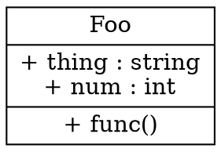

# Coding

The focus of this page is the actual implementation of logic

# Binary Hacks

## Determine if integer is odd
```c
if ((x & 1) == 0) {
  //x is even
} else {
  //x is odd
}
```

## Determine if nth bit is set

```c
if (x & (1<<n)) {
  // n-th bit is set
} else {
  //  n-th bit is not set
}
```

## Set the nth bit

```c
y = x | (1<<n)
```


## Unset the nth bit

```c
y = x & ~(1<<n)
```


## Toggle the nth bit

```c
y = x ^ (1<<n)
```


# Demoscene tricks

## Fixed point math

Take a 16-bit integer, and break it into two 8 bit parts, an integer part and a fractional part.
Addition and subtraction are the same, but for multiplication and division you will need to do bit shifting

	A = ( C * D ) >> 8
	A = ( C << 8 ) / D


## Interpolation

k is within 0..1

	C = A + (B-A) * k

# comby

https://comby.dev

flag           | desc
---            | ---
-f SUFFIX      | search for files with suffix
-i             | replace files in-place
-d DIR         | only files in DIR
-diff          | get patches as unified diffs
-templates DIR | use a template directory (see below)

## matching syntax

pattern    | desc
---        | ---
:[hole]    | match zero or more characters (including whitespace, and across newlines) in a lazy fashion. When :[hole] is inside delimiters, as in {:[h1], :[h2]} or (:[h]), matching stops inside them. Holes can be used outside of delimiters as well.
:[[hole]\] | match one or more alphanumeric characters and _
:[hole.]   | (with a period at the end) matches one or more alphanumeric characters and punctuation (like ., ;, and -)
:[hole\n]  | (with a \n at the end) matches one or more characters up to a newline, including the newline.
:[ ]	(with a space) matches only whitespace characters, excluding newlines. To assign the matched whitespace to variable, put the variable name after the space, like :[ hole].
:[?hole]   | (with a ? before the variable name) optionally matches syntax. Optional holes work like ordinary holes, except that if they fail to match syntax, the variable is assigned the empty string "". Optional hole support is currently an experimental feature.

## templates

Create a directory with `match` and `rewrite` files

```bash
comby .go -templates /path/to/dir
```
# Style Guides

[Google Style Guides](<https://google.github.io/styleguide/>)
# Refactoring by Martin Fowler


* "Any fool can write code that a computer can understand. Good programmers write code that humans can understand."
* Switch statements should only be on your own data
* "Three strikes and you refactor"


# Design Patterns

Knowledge of design patterns make it easier to hold software designs in your head (a la memory chunking)

## Singleton

```python
class Singleton:
    __single = None
    def __init__( self ):
        if Singleton.__single:
            raise Singleton.__single
        Singleton.__single = self
```
# Trace Assertion Method

## Papers

- Using Traces to Write Abstract Specifications for Software Modules (Wolfram Bartussek and David Parnas)
# UML

Unified Modeling Language

## DOT

Node must be shape of record



http://www.ffnn.nl/pages/articles/media/uml-diagrams-using-graphviz-dot.php

## links

https://www.uml.org/
# refactorings


# Refactorings

* Extract method -> move block of code into a separate function
* Move method -> move function to class that uses it most, removing or delegating it in the old class
* Replace temp with query -> Replace a temporary variable with a query
* Form template method -> Get the steps of two similar subclasses into methods with the same signature (to reduce duplication)
* Replace type with state/strategy -> Replace type code with a state object
* Replace conditional with polymorphism -> Move each leg of the conditional to an overriding method in a subclass. Make the original method abstract.
* Self encapsulate field -> Using get and set methods to access variables


# 12 Factor App

* <http://www.12factor.net/>
* <https://medium.com/@kelseyhightower/12-fractured-apps-1080c73d481c>

* Codebase
  * One codebase tracked in revision control, many deploys (i.e. it's all in Git)
* Dependencies
  * Explicitly declare and isolate dependencies. Don't rely on system tools - app should be self-contained.
* Config
  * Store config using environment variables (which won't be accidentally committed). Ask yourself "could this be open-sourced **right now**?"
* Backing Services
  * Treat backing services as attached resources
* Build, release, run
  * Strictly separate build and run stages
* Processes
  * Execute the app as one or more stateless processes
* Port binding
  * Export services via port binding
* Concurrency
  * Scale out via the process model
* Disposability
  * Maximize robustness with fast startup and graceful shutdown
* Dev/prod parity
  * Keep development, staging, and production as similar as possible
* Logs
  * Treat logs as event streams
* Admin processes
  * Run admin/management tasks as one-off processes


