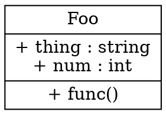

# UML

Unified Modeling Language

## DOT

Node must be shape of record

```dot
digraph U {
        node [
                shape = "record"
        ]

        Foo [
                label = "{Foo|+ thing : string\l+ num : int|+ func()}"
        ]
}
```

http://www.ffnn.nl/pages/articles/media/uml-diagrams-using-graphviz-dot.php

## links

https://www.uml.org/
